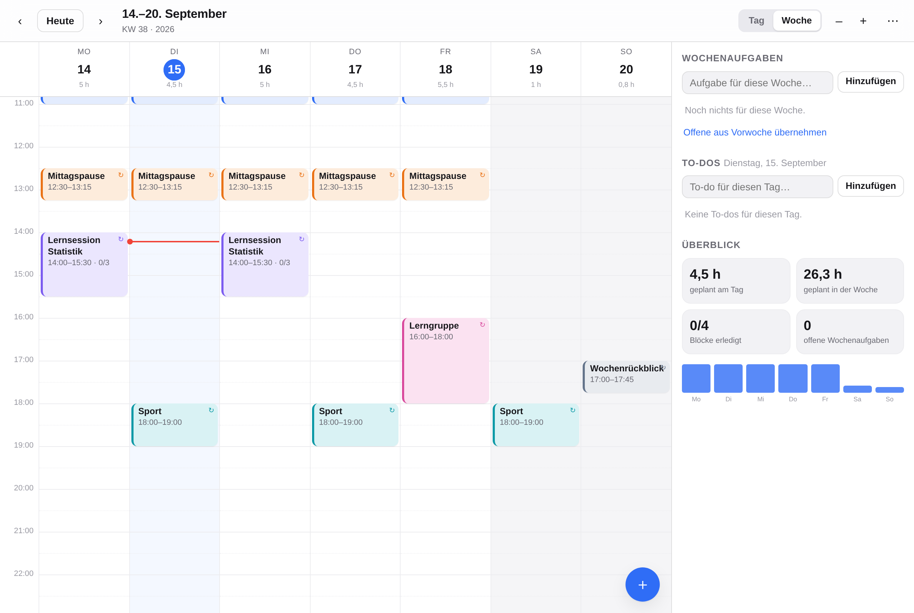

# Tagwerk

Tages- und Wochenplaner mit verschiebbaren Zeitblöcken – für iPhone **und** Mac.
Läuft komplett lokal im Browser, ohne Konto, ohne Server, offline.



## Das Konzept

Drei Ebenen, die zusammenspielen:

| Ebene | Wofür | Wo |
|---|---|---|
| **Zeitblöcke** | Der eigentliche Tagesplan: „Deep Work 9–11", „Lernsession Statistik 14–15:30" | Kalenderraster, per Finger/Maus verschieb- und dehnbar |
| **Wochenaufgaben** | Was diese Woche irgendwann passieren muss – ohne festen Termin | Seitenleiste, an die Kalenderwoche gebunden |
| **To-dos** | Kleinkram für einen Tag, plus Checklisten *innerhalb* eines Blocks (z. B. Schritte einer Lernsession) | Seitenleiste bzw. im Block-Editor |

Der Kniff: Aufgaben lassen sich mit einem Tipp (📅) in einen echten Zeitblock verwandeln –
die App sucht dafür automatisch die nächste freie Lücke im Tag.

## Funktionen

**Planen**
- Wochen- und Tagesansicht, Raster frei einstellbar (5–60 min)
- Blöcke ziehen (Zeit **und** Wochentag), an beiden Kanten dehnen
- Anlegen: auf dem Mac ins leere Raster ziehen, auf dem Handy antippen –
  im Editor füllt die Schnellwahl zuletzt benutzte Blöcke mit einem Tipp
- Ziehen bis an den oberen oder unteren Rand scrollt das Raster mit
- Überlappende Blöcke werden automatisch nebeneinander gelegt
- 8 Farben, Notizen, „Erledigt"-Haken, Jetzt-Linie, Zoom, Dunkelmodus

**Wiederholen**
- wöchentlich, alle 2, 3 oder 4 Wochen
- beliebige Wochentag-Kombination (z. B. Mo + Mi + Fr)
- optionales Serienende
- Einzelne Termine dürfen abweichen: Verschieben wirkt erst nur auf diesen Termin,
  per Tipp auf „Ganze Serie" im Hinweis gilt es für alle. Genauso beim Bearbeiten und Löschen.

**Aufgaben**
- Wochenaufgaben pro Kalenderwoche, offene per Klick aus der Vorwoche übernehmen
- Tages-To-dos
- Checkliste pro Block – die Haken gelten nur für den einzelnen Termin,
  die Schritte selbst für die ganze Serie (perfekt für wiederkehrende Lernsessions)

**Wochen-Vorlagen**
- Eine gelungene Woche als Vorlage sichern (Menü ⋯ → *Wochen-Vorlagen*)
- Auf jede andere Woche anwenden – wahlweise *Woche ersetzen* (räumt vorher auf,
  Serien pausieren dann nur in dieser einen Woche) oder *hinzufügen*
- Beliebig viele Vorlagen, umbenennbar, mit Rückgängig-Hinweis nach dem Anwenden

**Geräte-Übertragung**
- Menü ⋯ → *Auf anderes Gerät übertragen* erzeugt einen Link, der den kompletten
  Stand komprimiert selbst enthält (gzip + base64) – kein Server, kein Konto
- Auf dem iPhone per *Teilen…* direkt in iMessage/AirDrop, auf dem Mac per Kopieren
- Beim Öffnen auf dem anderen Gerät: *Ersetzen* oder *Zusammenführen*
- Das ist eine Übertragung, **kein laufender Abgleich** – beide Geräte speichern weiter für sich

**Jetzt-Leiste**
- Über dem Raster steht, was gerade läuft oder als Nächstes ansteht – mit Restzeit
- Ein Tipp startet die Session für den laufenden Block bzw. öffnet den nächsten
- Läuft eine Fokus-Session, zeigt die Leiste sie samt Restzeit (am Handy der einzige
  Platz dafür – in der Kopfzeile bliebe für das Datum sonst nichts übrig)

**Fokus-Session**
- Block starten (Kontextmenü, Editor oder Taste `F`): Countdown über die geplante Dauer,
  Checkliste zum Abhaken, Notizen im Blick
- Pause, +5 Minuten, abbrechen oder „Erledigt" (hakt den Termin ab)
- Läuft im Hintergrund weiter – die Kopfzeile zeigt die Restzeit, ein Klick holt die Ansicht zurück
- Ist die Zeit um, meldet sich die App mit kurzem Ton und Vibration

**Bedienung**
- Rechtsklick auf einen Block: bearbeiten, erledigt, duplizieren, Farbe, löschen
- Tastatur: Blöcke sind mit `Tab` erreichbar, Pfeile verschieben, `⇧`+Pfeil dehnt,
  `⌥`+Pfeil in 5-Minuten-Schritten, `Enter` öffnet, `Entf` löscht, `F` startet die Session
- Aufgaben lassen sich aus der Seitenleiste direkt ins Raster ziehen
- Auf dem Handy: die App startet in der Tagesansicht, waagerecht wischen blättert,
  senkrecht scrollt, Tippen legt an, langes Drücken auf einem Block startet das Verschieben
- Die Wochenansicht scrollt auf schmalen Geräten seitlich (Stundenleiste und Kopfzeile
  bleiben stehen), statt sieben Spalten zu Streifen zu quetschen
- Menü, Editor und Auswahl fahren als Blatt von unten hoch; Eingabefelder lösen kein
  Zoomen aus, Tippziele sind fingergerecht

**Überblick & Ziele**
- Farben lassen sich benennen (Lernen, Uni, Sport, Nebenjob …) – die Woche wird danach aufgeschlüsselt
- Optionales Wochenziel je Kategorie: „Lernen 10 / 12 h", erreicht wird mit ✓ markiert
- Tagesbalken zeigen geplant und davon erledigt; ein Klick springt auf den Tag
- Kennzahlen: Stunden heute, Stunden diese Woche, erledigte Blöcke, Anteil der Woche

**Drumherum**
- Woche drucken (Menü ⋯) – eigenes Drucklayout im Querformat, ohne Bedienelemente
- Rückgängig/Wiederherstellen (⌘Z / ⇧⌘Z)
- Sicherung als JSON exportieren und importieren (auch zum Umzug aufs zweite Gerät)
- Automatische Sicherheitskopie vor „alles löschen" und vor einem ersetzenden Import –
  im Menü zurückholbar (nochmal zurückholen führt wieder zurück)
- Beispielwoche zum Ausprobieren (Menü ⋯)
- Offline nutzbar, Daten bleiben auf dem Gerät

**Kurzbefehle:** `←`/`→` blättern · `T` heute · `D`/`W` Ansicht · `N` neuer Block · `F` Fokus · `⌘Z` zurück · `Esc` schließen

## Auf dem Gerät installieren

Die App ist eine PWA – kein App Store, keine Installation im klassischen Sinn.

**iPhone/iPad:** Adresse in **Safari** öffnen → Teilen-Symbol → *Zum Home-Bildschirm*.
Danach startet Tagwerk wie eine native App im Vollbild, inklusive Icon.

**Mac:**
- Safari 17+: Adresse öffnen → *Ablage* → *Zum Dock hinzufügen*
- Chrome/Edge: Symbol „Installieren" in der Adressleiste

**Wichtig:** Die Daten liegen pro Gerät im lokalen Speicher des Browsers – iPhone und Mac
synchronisieren sich also *nicht* automatisch. Für den Umzug: Menü ⋯ → *Daten sichern (JSON)*
und auf dem anderen Gerät → *Daten laden (JSON)*.

### Veröffentlichen

Jeder Static-Hoster genügt, die App braucht keinen Build-Schritt.

- **Vercel (eingerichtet):** `vercel.json` liegt bei – kein Install, als „Build" laufen die
  Logiktests (ein roter Test verhindert das Deployment), ausgeliefert wird das Repo-Wurzelverzeichnis.
  Ist das Projekt mit dem Repository verbunden, geht jeder Push auf den Default-Branch live.
- **GitHub Pages:** in den Repo-Einstellungen unter *Pages* als Quelle *GitHub Actions* wählen –
  `.github/workflows/pages.yml` veröffentlicht dann jeden Push auf `main`.
- **Netlify/Cloudflare Pages:** Repo verbinden, kein Build-Befehl, Ausgabeverzeichnis `.`
- **Eigener Server:** Ordner hochladen. HTTPS ist Pflicht, sonst startet der Service Worker nicht.
- **Ganz ohne Server:** `node scripts/build.mjs` erzeugt `dist/index.html` – eine einzige Datei,
  die sich per Doppelklick öffnen lässt und alles enthält.
- **Als Artifact-Seite:** `ARTIFACT=1 node scripts/build.mjs <ziel>` schreibt `tagwerk.artifact.html`
  ohne eigenes HTML-Gerüst (das bringt die Seite dort mit) und ohne Service-Worker-Anmeldung.

## Lokal starten

```bash
npm run dev          # http://localhost:4173
npm test             # 30 Logiktests (Serien, Datum, Vorlagen, Übertragung, Sicherung, Speicher)
npm run test:browser # 72 End-to-End-Checks im echten Chromium (Ziehen, Tastatur, Kontextmenü,
                     # Fokus-Session, Vorlagen, Übertragung, Sicherung, Kategorien,
                     # Druckansicht, Mobil, Dunkelmodus)
```

Node 22+, sonst nichts. **Null Abhängigkeiten** – kein Bundler, kein Framework,
`index.html` lässt sich notfalls direkt öffnen.

## Aufbau

```
index.html            Gerüst
styles.css            Design-Tokens, Hell/Dunkel, Handy-Layout
app/
  dates.js            Datum, ISO-Kalenderwochen, Formatierung
  store.js            Zustand, localStorage, Undo, Export/Import
  recurrence.js       Serien → konkrete Termine, Überlappungs-Layout
  grid.js             Raster, Ziehen, Dehnen, Anlegen (Maus + Touch)
  editor.js           Block-Editor (Serien, Checkliste, Farben)
  panels.js           Wochenaufgaben, Tages-To-dos, Überblick, Ziehen ins Raster
  session.js          Fokus-Session mit Countdown und Checkliste
  templates.js        Wochen-Vorlagen sichern und anwenden
  transfer.js         Übertragung zwischen Geräten per Link
  ui.js               Sheet, Menü, Toasts
sw.js                 Service Worker (Offline)
scripts/              Dev-Server, Icon-Generator, Browser-Test, Einzeldatei-Build,
                      Bildschirmfotos im Handyformat
tests/run.mjs         Logiktests
```

### Datenmodell

Ein Block ist entweder ein Einzeltermin oder eine Serienvorlage:

```js
{ id, title, color, notes, date, start /* Minuten ab 0 Uhr */, duration,
  todos: [{ id, title, done }],
  recur: { every: 2, weekdays: [1, 3], until: null } | null }
```

Abweichungen einzelner Serientermine liegen in `overrides["blockId|YYYY-MM-DD"]`
(`start`, `duration`, `movedTo`, `deleted`, `todoDone`, …). Dadurch bleibt die Serie
eine einzige Zeile, und trotzdem darf jeder Termin anders sein.

Datumsarithmetik läuft über UTC-Tagesindizes, damit Sommer-/Winterzeit nichts verschiebt.

## Später möglich

- **Echter Live-Sync** zwischen Mac und iPhone. Das geht nur mit einer Ablage im Netz;
  der Übertragungslink ist der serverlose Ersatz. Möglich wären: eine kleine Funktion auf
  Vercel mit Speicher-Add-on, ein eigener Mini-Server, oder eine Datei in iCloud Drive.
- Abo-Import aus bestehenden Kalendern (`.ics`)
- Als echte Desktop-App verpacken (Tauri oder Electron um dieselben Dateien)
- Statistik über längere Zeiträume (geplant vs. tatsächlich erledigt)

## Lizenz

MIT
